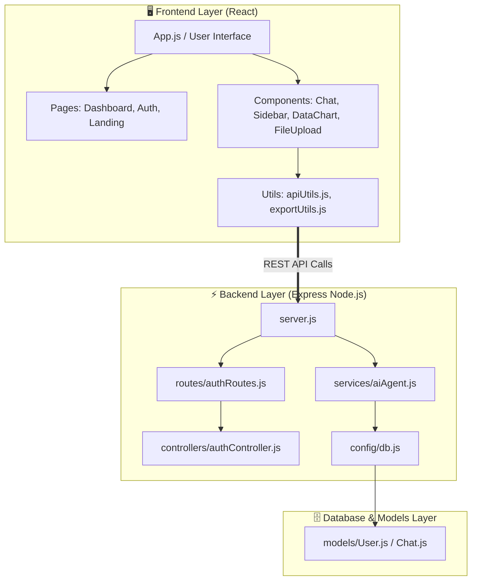

## 🏗️ Application Architecture

```mermaid
graph TB
    %% Client Tier
    subgraph Client ["🖥️ Frontend Layer (React)"]
        direction TB
        UI[App.js / User Interface]
        Pages[Pages: Dashboard, Auth, Landing]
        Components[Components: Chat, Sidebar, DataChart, FileUpload]
        Utils[Utils: apiUtils.js, exportUtils.js]
        
        UI --> Pages
        UI --> Components
        Components --> Utils
    end

    %% Server Tier
    subgraph Server ["⚡ Backend Layer (Express Node.js)"]
        direction TB
        API[server.js]
        Routes[routes/authRoutes.js]
        Controllers[controllers/authController.js]
        AI[services/aiAgent.js]
        DBConfig[config/db.js]

        API --> Routes
        API --> AI
        Routes --> Controllers
        AI --> DBConfig
    end

    %% Database Tier
    subgraph Database ["🗄️ Database & Models Layer"]
        Models[models/User.js / Chat.js]
        DBConfig --> Models
    end

    %% Flow Connections
    Utils ==>|REST API Calls| API
```