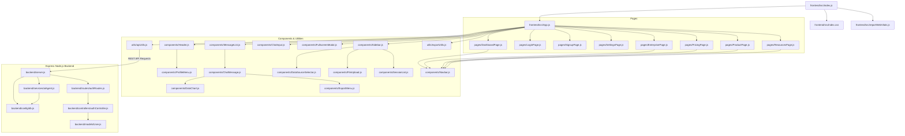

## 🏗️ Application Architecture

```mermaid
graph TD
    %% Global Entry Point
    index.js[frontend/src/index.js] --> App.js[frontend/src/App.js]
    index.js --> index.css[frontend/src/index.css]
    index.js --> reportWebVitals[frontend/src/reportWebVitals.js]

    %% Frontend - App Routes & Pages
    subgraph FrontendPages [Pages]
        App.js --> DashboardPage[pages/DashboardPage.js]
        App.js --> LoginPage[pages/LoginPage.js]
        App.js --> SignupPage[pages/SignupPage.js]
        App.js --> SettingsPage[pages/SettingsPage.js]
        App.js --> EnterprisePage[pages/EnterprisePage.js]
        App.js --> PricingPage[pages/PricingPage.js]
        App.js --> ProductPage[pages/ProductPage.js]
        App.js --> ResourcesPage[pages/ResourcesPage.js]
    end

    %% Frontend Components & Utilities
    subgraph FrontendComponents [Components & Utilities]
        App.js --> Header[components/Header.js]
        App.js --> Sidebar[components/Sidebar.js]
        App.js --> MessageList[components/MessageList.js]
        App.js --> ChatInput[components/ChatInput.js]
        App.js --> FullscreenModal[components/FullscreenModal.js]
        App.js --> apiUtils[utils/apiUtils.js]
        App.js --> exportUtils[utils/exportUtils.js]

        Header --> ProfileMenu[components/ProfileMenu.js]
        MessageList --> ChatMessage[components/ChatMessage.js]
        ChatMessage --> DataChart[components/DataChart.js]
        ChatMessage --> ExportMenu[components/ExportMenu.js]
        Sidebar --> DataSourceSelector[components/DataSourceSelector.js]
        Sidebar --> FileUpload[components/FileUpload.js]
        Sidebar --> SessionList[components/SessionList.js]

        DashboardPage --> Navbar[components/Navbar.js]
        EnterprisePage --> Navbar
        PricingPage --> Navbar
        ProductPage --> Navbar
        ResourcesPage --> Navbar
    end

    %% Backend Architecture
    subgraph Backend [Express Node.js Backend]
        server.js[backend/server.js] --> db.js[backend/config/db.js]
        server.js --> authRoutes[backend/routes/authRoutes.js]
        server.js --> aiAgent[backend/services/aiAgent.js]

        authRoutes --> authController[backend/controllers/authController.js]
        authController --> User[backend/models/User.js]
        aiAgent --> db.js
    end

    %% API Connection
    apiUtils -->|REST API Requests| server.js
```